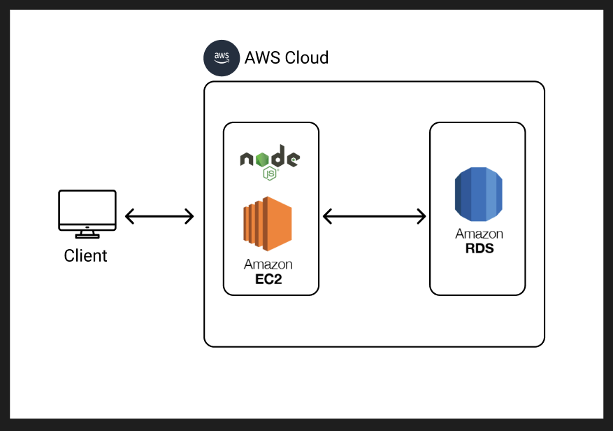

# # 원티드 프리온보딩 백엔드 인턴십 - 선발 과제

## 목차

1. [지원자의 성명](#지원자의-성명)
2. [애플리케이션의 실행 방법](#애플리케이션의-실행-방법)
3. [데이터베이스 테이블 구조](#데이터베이스-테이블-구조)
4. [구현한 API 데모 영상 링크](#구현한-api-데모-영상-링크)
5. [구현 방법 및 이유에 대한 간략한 설명](#구현-방법-및-이유에-대한-간략한-설명)
6. [API 명세](#api-명세)
7. [AWS 설계도](#aws-설계도)
     

# 지원자의 성명

안녕하세요. 주니어 백엔드개발자 김학성입니다!
  

# 애플리케이션의 실행 방법

프로젝트에서 `.env.example` 파일을 `.env`로 복사하여 데이터베이스 접속 정보를 입력하고 터미널에서 `node index.js`를 입력하여 실행할 수 있습니다.

엔드포인트 호출 방법은 [해당 링크](http://ec2-52-78-88-200.ap-northeast-2.compute.amazonaws.com/docs)에서 Swagger를 통해 호출이 가능합니다.
로그인이 필요한 엔드포인트의 경우 로그인 후 응답의 `token`을 우측 상단 `Authorize`를 통해 인증 후 호출하실 수 있습니다.

  

# 데이터베이스 테이블 구조

데이터베이스 테이블 구조는 [erdcloud 링크](https://www.erdcloud.com/d/bNwfRxD7AKENWqf3q)에서 확인할 수 있습니다.
  

# 구현한 API 데모 영상 링크

해당 [구글 드라이브 링크](https://drive.google.com/file/d/1ci9tEtv15mB55JxGilKShtZ74UpTELNu/view)에서 확인할 수 있습니다.
  

# 구현 방법 및 이유에 대한 간략한 설명

## ORM 적용

데이터베이스를 추상화하여 조금 더 객체지향 방식으로 데이터를 다룰 수 있고 가독성과 유지보수성을 위해 적용하였습니다. 또한 모델이 변경됨에 따라 자동으로 데이터베이스와 동기화하여 직접 수정해서 발생할 수 있는 실수를 예방하도록 하였습니다.
  

## 인증

인증이 필요한 엔드포인트의 경우 별도의 미들웨어를 통해 header를 통한 Bearer token의 jwt를 검증하고 이에 따른 상태 코드를 반환할 수 있도록 적용하였습니다.
  

## 사용자 관리 API

### 유효성 체크

요구사항에 따라 회원가입과 로그인 시 이메일과 비밀번호에 대한 유효성 체크를 `express-validator` 라이브러리를 통해 적용하였습니다.
직접 유효성 체크를 위한 로직을 작성하지 않고 간단하고 직관적인 문법으로 쉽게 구현하였고 미들웨어 형태로 되어있고 모델별 유효성 체크를 엔드포인트별로 나누어 손쉽게 적용할 수 있었습니다.

### 암호화

사용자 비밀번호는 유명한 `bcrypt` 라이브러리를 통해 해시화하여 저장하였고, 이로 인해 비밀번호를 안전하게 데이터베이스에서 저장할 수 있었습니다.
  

## 게시판 관리 API

### 유효성 체크

사용자 관리와 동일하게 `express-validator` 라이브러리로 게시판 엔드포인트에서 유효성 체크도 간단하고 직관적으로 작성하고 관리할 수 있었습니다.
  

# API 명세

API 명세는 [Postman documantation 링크](https://documenter.getpostman.com/view/12779641/2s9XxyRZGq)에서 확인할 수 있습니다.
  

# AWS 설계도

